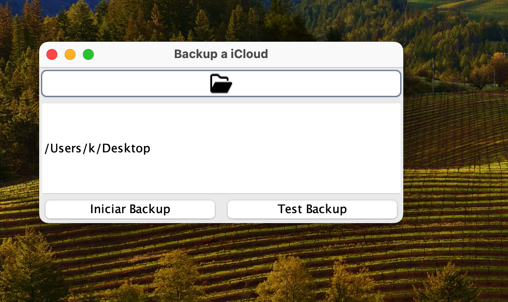
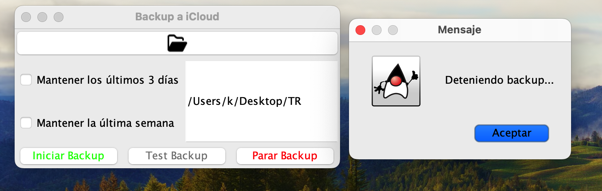

# Proyecto de Backup en Java

## Descripción

Este proyecto personal de una aplicación sencilla en Java diseñada para realizar copias de seguridad de una carpeta específica en un sistema macOS en la carpeta iCloud del equipo. La aplicación presenta una interfaz gráfica (GUI) que permite a los usuarios ejecutar el proceso de backup manualmente.

## Capturas





## Características

- **Copia de Seguridad:** Realiza copias de seguridad de una carpeta en macOS hacia iCloud utilizando un script Bash.
- **Interfaz Gráfica:** Presenta una interfaz gráfica para facilitar la ejecución manual del backup.
- **Automatización:** [🛠️ _En desarrollo_] Puede configurarse para realizar copias de seguridad diarias utilizando cron jobs.

## Requisitos

- **Java 17 o superior**: Este proyecto está diseñado para funcionar con versiones recientes de Java.
- **macOS**: El script de backup está diseñado para funcionar específicamente en sistemas macOS.No se garantiza que funcione debidamente en otros sistemas operativos

## Instalación

### 1. Clonar el repositorio

```bash
git clone https://github.com/tu-usuario/backup-java.git
cd backup-java
```

### 2. Ejecutar la aplicacion

Para ejecutar la aplicación directamente desde la terminal:
`java -cp bin BackupApp`

### 3. Compilar el repositorio

`javac -d bin src/BackupApp.java src/CronManager.java`

`jar cfm BackupApp.jar src/MANIFEST.MF -C bin .`

Ejecutar

`java -jar BackupApp.jar`

#### Uso

La aplicación presenta una sencilla interfaz gráfica donde puedes ejecutar manualmente el proceso de backup haciendo clic en un botón.

#### Configuración del script de backup

El script de backup se encuentra en el directorio scripts/backup.sh. Puedes modificarlo para especificar la carpeta de origen y la ruta en iCloud donde se guardará la copia.

\*Para que los paths de los archivos funcionen correctamente, establecer el APP_ENV (`export APP_ENV="development"`)

#### Contribuciones

Las contribuciones son bienvenidas. Si encuentras algún problema o tienes ideas para mejorar la aplicación, por favor abre un issue o envía un pull request.

#### Licencia

Este proyecto está licenciado bajo la Licencia MIT.
